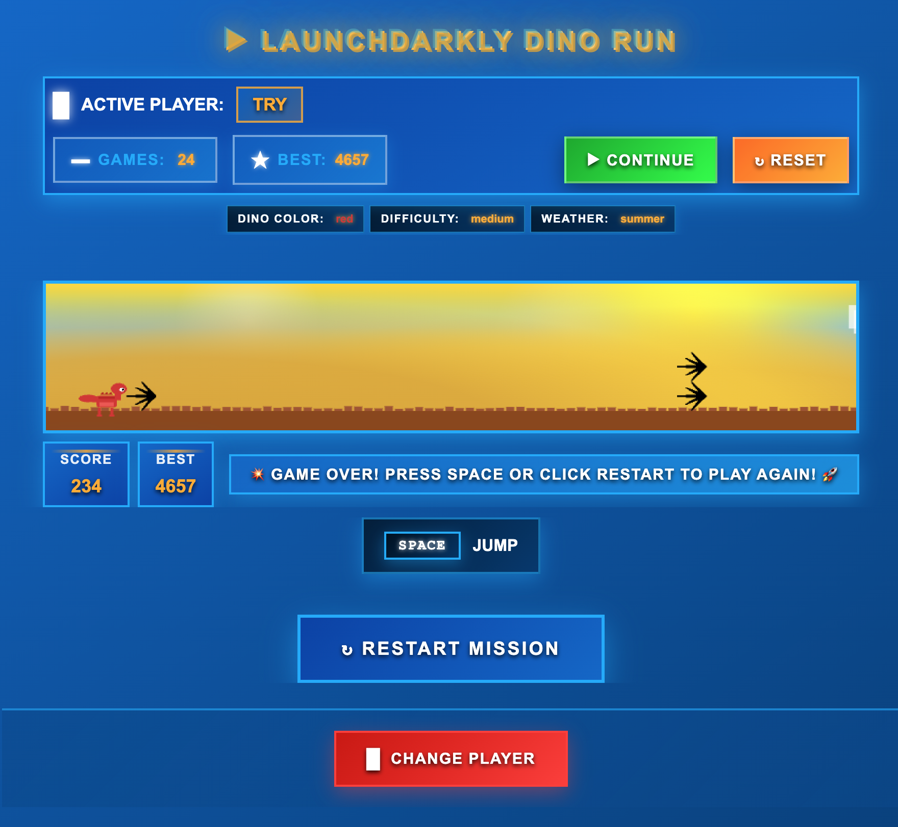
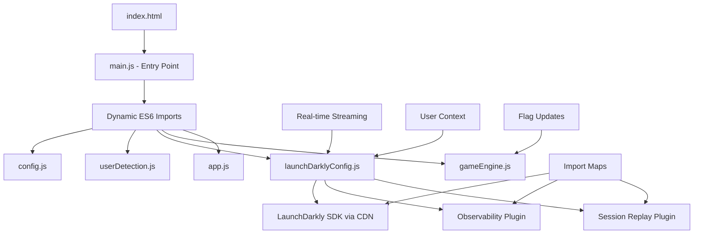

# 🦕 LaunchDarkly Dino Run



> **🎮 Experience the power of feature flags in action!** 
> 
> A browser-based Dino Run game with LaunchDarkly feature flags integration. Control game features dynamically without code deployments! Watch as dinosaur colors, difficulty levels, and weather effects change instantly through your LaunchDarkly dashboard.

## 🎯 What You'll See

In the game above, you can observe:
- **🦕 Dynamic Dino Colors**: Switch between 6 vibrant colors instantly
- **🌈 Seasonal Weather**: Beautiful backgrounds that change with feature flags  
- **🎮 LaunchDarkly Dashboard**: Real-time flag controls visible in the interface
- **⚡ Instant Updates**: Changes apply without page refresh - true real-time feature flagging!

## ✨ Features

- **Classic Dino Run Gameplay**: Jump over obstacles and score points
- **LaunchDarkly Integration**: Three feature flags control game behavior:
  - 🎨 **Dino Color**: 6 color options (green, blue, red, purple, orange, pink)
  - 🎯 **Difficulty**: 3 levels (easy, medium, hard) affecting speed and obstacles
  - 🌤️ **Weather**: 4 seasonal backgrounds (spring, summer, autumn, winter)
- **Responsive Design**: Works on desktop and mobile
- **Player Profiles**: Save names and track high scores
- **Real-time Updates**: Changes apply instantly without page refresh

## 🚀 Quick Start

### 1. Install and Run
```bash
npm install
npm start
```
The game will open at `http://localhost:3000`

### 2. Play the Game
- Press **SPACE** to start and jump
- Avoid brown obstacles
- Try to beat your high score!

### 3. Set Up LaunchDarkly (Optional)
Without LaunchDarkly, the game runs with default settings. To enable feature flags:

#### Option A: Automated Setup (Recommended)
```bash
# Install Terraform (macOS)
brew install terraform

# Configure and deploy
cd terraform
cp terraform.tfvars.example terraform.tfvars
# Edit terraform.tfvars with your LaunchDarkly access token

terraform init
terraform apply
```

#### Option B: Manual Setup
1. Sign up at [LaunchDarkly](https://launchdarkly.com)
2. Copy `environment.example` to `.env` and add your client-side ID
3. Update `config.js` with your client-side ID
4. Create three feature flags in LaunchDarkly:
   - `dino-color` (string: green, blue, red, purple, orange, pink)
   - `game-difficulty` (string: easy, medium, hard)  
   - `weather-background` (string: spring, summer, autumn, winter)

## 📁 Project Structure

```
ld-dino-run/
├── index.html              # Main game page
├── config.js               # Configuration management
├── main.js                 # ES6 module entry point
├── launchDarklyConfig.js   # LaunchDarkly integration
├── gameEngine.js           # Game mechanics
├── userDetection.js        # Player management
├── app.js                  # Application logic
├── styles.css              # Game styling
├── terraform/              # Infrastructure automation
└── environment.example     # Environment template
```

## 🎮 How It Works

The game integrates with LaunchDarkly to demonstrate real-time feature flag capabilities:

- **Dino Color**: Changes dinosaur appearance instantly
- **Difficulty**: Adjusts obstacle speed, frequency, and jump height
- **Weather**: Updates background theme and colors

**Real-time Updates**: Changes made in the LaunchDarkly dashboard apply immediately (1-2 seconds) without refreshing the page. The game uses LaunchDarkly's streaming API for instant flag updates.

**Connection Management**: Singleton pattern ensures only one LaunchDarkly connection per session, preventing performance issues and duplicate events.

## 🏗️ Technical Architecture

The game is built with modern ES6 modules and integrates seamlessly with LaunchDarkly's streaming API:



### Key Architecture Features:
- **🎯 ES6 Modules**: Modern import/export with CDN-based dependencies
- **📡 Real-time Streaming**: LaunchDarkly's streaming API for instant flag updates  
- **🔄 Dynamic Imports**: Error-resilient module loading with fallbacks
- **🏪 Singleton Pattern**: Single LaunchDarkly client instance for optimal performance
- **🔌 Plugin Ready**: Infrastructure for Observability and Session Replay
- **📱 Import Maps**: Browser-native module resolution via `esm.run` CDN

## 🔧 Development

### Environment Configuration
```bash
cp environment.example .env
# Edit .env with your LaunchDarkly credentials
```

### Debugging & Monitoring
The game includes comprehensive debugging tools for LaunchDarkly integration:
- **Real-time monitoring**: Track connection status, flag values, and streaming health
- **Keyboard shortcuts**: Quick access to diagnostic information (Alt+D, Alt+S, Alt+C)
- **Browser console methods**: Detailed APIs for testing and troubleshooting
- **Connection management**: Automatic prevention of duplicate LaunchDarkly instances

### Testing in Browser Console
```javascript
// Quick diagnostic (most useful for troubleshooting)
window.debugDinoRun.quickTest()

// Test name change functionality  
window.debugDinoRun.testNameChange("NewPlayerName")

// Check LaunchDarkly status
window.ldManager.getStatus()

// Test all flag values
window.ldManager.test()

// Check current user context
window.ldManager.getCurrentContext()

// Test streaming connection
window.ldManager.testStreaming()

// Monitor connections (prevent multiple instances)
window.ldManager.checkConnections()

// Access individual flags
window.ldManager.getDinoColor()
window.ldManager.getDifficulty()
window.ldManager.getWeather()

// Access game instance
window.dinoApp.game

// Show all available debug utilities
window.debugDinoRun.showHelp()
```

### Keyboard Shortcuts
- **SPACE**: Jump / Start game
- **Alt + R**: Refresh LaunchDarkly connection
- **Alt + D**: Show LaunchDarkly status
- **Alt + T**: Test all flags
- **Alt + U**: Show current user context
- **Alt + S**: Test streaming connection
- **Alt + C**: Check connection count
- **Alt + V**: Start Session Replay recording (when enabled)
- **Alt + X**: Stop Session Replay recording (when enabled)
- **Alt + Z**: Check Session Replay status (when enabled)

## 📊 Observability & Analytics

The game includes LaunchDarkly observability features for tracking user behavior and flag performance:

### Built-in Tracking
- Game events (start, end, collisions)
- Performance metrics
- Flag evaluation tracking
- User session management

### Optional Enhancements
For advanced observability, you can add:
- Session replay recording
- Enhanced performance monitoring
- Custom event tracking

See the [Observability Guide](docs/observability.md) for detailed implementation.

## 🛠️ Troubleshooting

### Game Issues
- **Game won't start**: Check browser console for errors, ensure all files are loaded
- **Performance issues**: Close other browser tabs, check for JavaScript errors

### LaunchDarkly Issues
- **Flags not working**: 
  - Run `window.ldManager.getStatus()` in console
  - Verify client-side ID (not SDK key) in `config.js`
  - Check flags are ON in LaunchDarkly dashboard
  - Ensure flag keys match between `config.js` and LaunchDarkly

- **CSP (Content Security Policy) Errors**: 
  - If you see "Refused to connect to 'https://clientstream.launchdarkly.com'" errors
  - The CSP in `index.html` includes required LaunchDarkly domains
  - Required domains: `clientsdk.launchdarkly.com`, `stream.launchdarkly.com`, `clientstream.launchdarkly.com`, `events.launchdarkly.com`

- **Real-time updates not working**:
  - Check streaming status: `window.ldManager.testStreaming()`
  - Verify browser console shows "Streaming connection established"
  - Use Alt+S to test streaming connectivity
  - Changes in LaunchDarkly dashboard should apply within 1-2 seconds

- **Multiple connections / Performance issues**:
  - Check connection count: `window.ldManager.checkConnections()`  
  - Should show "✅ Single LaunchDarkly connection active"
  - If multiple connections, refresh the page
  - Singleton pattern prevents duplicate connections

### Terraform Issues
- **Permission errors**: Verify LaunchDarkly access token has writer permissions
- **Resource conflicts**: Check if project/flags already exist
- See `terraform/README.md` for detailed troubleshooting

## 🔒 Security

- Never commit `.env` files (they contain sensitive credentials)
- Use client-side IDs for browser applications (not server-side SDK keys)
- Environment variables are excluded by `.gitignore`
- Use `environment.example` as a template for team members

## 🌐 Browser Support

**Modern browsers with ES6 module support:**
- Chrome 61+ (recommended)
- Firefox 60+
- Safari 10.1+  
- Edge 16+

**Note**: The game uses ES6 modules with import maps, requiring modern browser support. For older browsers, a build step would be needed.

## 📄 License

MIT License - feel free to modify and distribute.

## 🤝 Contributing

1. Fork the repository
2. Create a feature branch
3. Test your changes with LaunchDarkly
4. Submit a pull request

---

**Ready to experiment with feature flags? Start playing and toggle flags in your LaunchDarkly dashboard! 🦕🚀** 